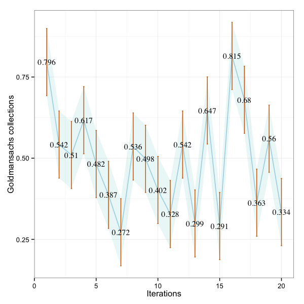

R wird benutzt, um die Daten eines JMH Benchmarks zu parsen und graphisch aufzubereiten.

##Achsentypen des Diagramms

<table>
    <thead>
    <tr>
         <td>Achsentypen</td>
         <td>Art</td>
         <td>Beschreibung</td>
    </tr>
    </thead>
    <tr>
        <td>Standardfehler des Mittelwerts (SEM)</td>
        <td>Inferentiell</td>
        <td>Ein Mass für die Variabilität des Mittelwerts, wenn die Studie sehr oft wiederholt wird.</td>
    </tr>
    <tr>
        <td>Konfidenzintervall (CI)</td>
        <td>Inferentiell</td>
        <td>Ein Wertebereich der mit 99 % Sicherheit den echten Mittelwert enthält.</td>
    </tr>
</table>

###Java Collections

R Zusammenfassung

<table>
    <thead>
    <tr>
         <td>Minimum</td>
         <td>1st Qu.</td>
         <td>Median</td>
         <td>Mittelwert</td>
         <td>3rd Qu.</td>
         <td>Maximum</td>
    </tr>
    </thead>
    <tr>
        <td> 0.2720</td>
    <td>0.3558</td>
    <td>0.5040</td>
    <td>0.4950</td>
    <td>0.5742</td>
    <td>0.8150</td>
    </tr>
</table>

#### R graph showing error bars and 99% CI as a band

###GS Collections

R summary

<table>
    <thead>
    <tr>
         <td>Min.</td>
         <td>1st Qu.</td>
         <td>Median</td>
         <td>Mean</td>
         <td>3rd Qu.</td>
         <td>Max.</td>
    </tr>
    </thead>
    <tr>

        <td>0.4860</td>
    <td>0.5780</td>
    <td>0.7970</td>
    <td>0.4950</td>
    <td>1.0060</td>
    <td>1.4770</td>
    </tr>
</table>

#### R graph showing error bars and 99% CI as a band

